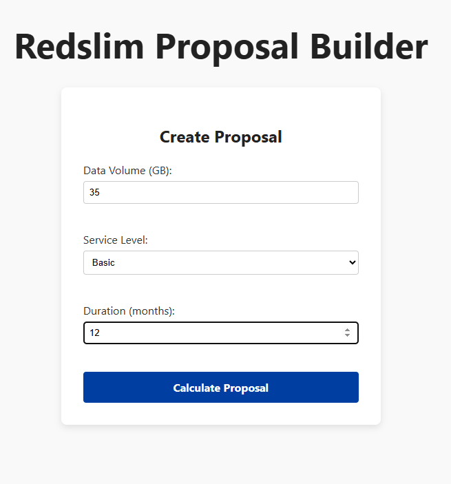
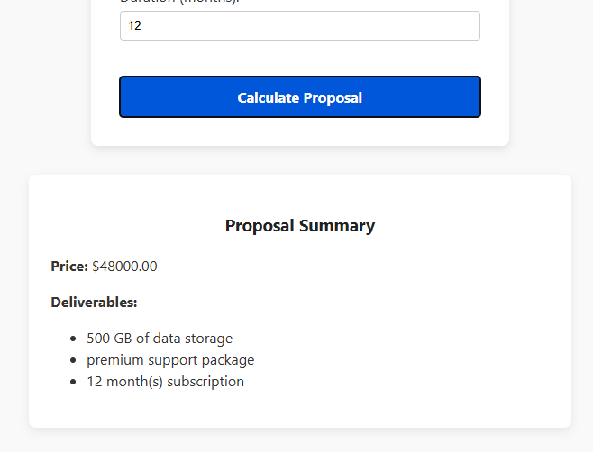

# Redslim UI Extension Demo

This is a demo frontend for the Redslim UI Extension, built to showcase how HubSpot UI Extensions can integrate with our middleware to provide dynamic proposal generation for Redslim’s data service offerings.

---

## Overview

This project is a React-based single-page application bootstrapped with [Vite](https://vitejs.dev/). It simulates a CPQ-like interface where users input parameters such as data volume, service level, and subscription duration, and then receive a calculated proposal with pricing and deliverables.

The frontend currently uses mocked calculation logic for demonstration purposes, with plans to integrate real backend middleware APIs from the [Inbound Fintech Middleware](https://github.com/InboundFintech/ift-middleware) once access is granted.

---

## Features

- Simple, clean UI to create custom proposals
- Dynamic calculation of pricing based on input parameters
- Deliverables list generated based on chosen options
- Easily extendable React components for quick iteration

---

## Getting Started

### Prerequisites

- [Node.js](https://nodejs.org/en/) v16+ installed
- Access to this repository (make sure you have permissions in the InboundFintech GitHub organization)

### Installation

1. Clone the repo:

```bash
git clone git@github.com:InboundFintech/redslim-ui-extension-demo.git
cd redslim-ui-extension-demo
```

### Before Submission



---

### After Submission


